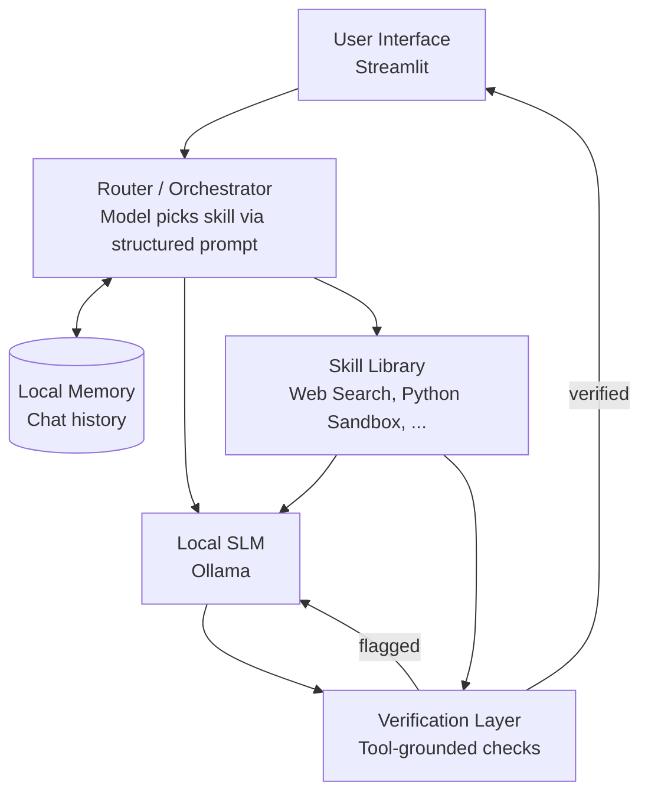

# Lightweight Local Agentic AI Assistant: Master Report

**Final Year Major Project, Department of Computer Engineering, VIVA Institute of Technology**

> **How this file is organised.** It serves two purposes: (1) a paste-in prompt for Antigravity to evaluate the project, and (2) a reference document for the team.
> - **Part A** is the instruction to the reviewer. Antigravity should read this first.
> - **Part B** is the thesis, current implementation status, and the ideas under consideration.
> - **Part C** is the full project reference (overview, literature survey, architecture, roadmap, limitations). Everything in Part C is the team's own claims. **Antigravity must treat Part C as claims to test, not as evidence.**

---

# PART A: EVALUATION PROMPT

You are a skeptical senior reviewer: part ML researcher, part product engineer, part startup advisor. Give an honest, critical evaluation of this project. Do not flatter it.

**Judge the actual code in this repo against the thesis in Part B, not against the claims in Part C.** Where the code and the documentation disagree, say so and name the file.

Cover each of the following:

1. **Uses.** Who would realistically use this, and for what.
2. **Where it is lacking.** Code, UX, architecture, and experimental design. Be specific and name files.
3. **Improvements to the current implementation.** What to fix in what already exists.
4. **What to add.** Assess the candidate features in B.5 and the design ideas in B.6. Say which are worth building, which to defer, and which are distractions.
5. **Comparison with the current AI market.** Search the web for current competitors (for example GPT4All, AnythingLLM, Jan, Open Interpreter, Goose, Obsidian AI plugins, NotebookLM). Do not rely on memory; this space moves fast. State where the project is differentiated and where it is not.
6. **Viability as a research paper.** Would a reviewer accept it? Which claims would they reject? What experiments are missing (baselines, datasets, metrics, ablations, model comparisons)? Which venue tier is realistic?
7. **Viability as a product or SaaS.** Is there a real business, or is this a feature that bigger players will absorb? Who pays, and for what?
8. **The "HQ" vision (B.6).** Is it coherent long-term positioning, or scope creep that dilutes the verification thesis? What is the smallest slice that can be credibly claimed now?

### Constraints on your recommendations

- **2 days left, about 3 hours per day. But i'll be using AI for** Anything recommended must fit that.
- End with a **ranked list of the top 5 fixes or additions doable in 2 days**, ordered by impact on a live demo and on the research story. For each: effort estimate, and the reason it ranks where it does.
- Separately list what should be **explicitly labelled future work** rather than attempted now.
- Where you are uncertain, say so. Do not invent benchmarks or citations.

### Output format requested

1. Verdict in three sentences.
2. Findings for each numbered item above, with file-level specifics.
3. Market comparison table, with sources.
4. Research-paper readiness: missing experiments and likely reviewer objections.
5. Product/SaaS viability: blunt assessment.
6. **Top 5 things to do in 2 days (ranked, with effort and rationale).**
7. What to label clearly as future work.

---

# PART B: THESIS, STATUS, AND IDEAS

## B.1 Core thesis (the standard to judge against)

The project is **not** "I built a local AI app." That space is crowded (Jan, GPT4All, AnythingLLM, Open Interpreter, Goose and others already do local tool use).

**The claim being tested:** tool-grounded self-verification (shown by CRITIC, 2023, on very large cloud models) may or may not still work reliably on tiny 1-4B parameter local models. The mechanism is simple: compare the model's claim against actual tool output. The research value is in rigorous empirical testing: error-catch rate, false negatives, and whether a small model overrides a correct tool result. (to be honest, i feel this is not a research paper more of a project, since we are just using existing frameworks and techniques and applying them to a local model, there is no novelty here)

**Research question:** *Does tool-grounded verification still improve reliability when the executor is a 1B-3.8B model running locally on modest hardware?*

**Architecture idea: brain + scaffolding + skills**
- **Brain:** a small local LLM via Ollama.
- **Scaffolding:** a rule-based router plus a verification layer.
- **Skills:** modular tools using progressive disclosure (a lightweight name-and-description list is always in the prompt; full instructions load only when a skill is selected), modelled on Claude's skills system.

**Gaps targeted** (from the 15-paper literature survey, Part C section C.4):
- **Gap 1:** no unified orchestration framework for small local models.
- **Gap 2:** self-correction and verification are unvalidated on small models.

**Constraints**
- Demo machine: Windows laptop (i5 11th gen, 8 GB RAM, integrated graphics, CPU-only inference expected). Windows access only on demo day.
- Dev machine: Mac Mini M2, 8 GB.
- Final-year B.E. project; demo in about 2 days; target a convincing 30-40% completion.

## B.2 Current implementation status

This is the team's own summary and may be generous. **Review the repo directly.**

### Completed and working
1. **Local LLM engine** (`llm.py`, `config.py`): Ollama integration with `qwen2.5:3b`; all settings centralised in `config.py`.
2. **Isolated Python sandbox** (`skills/python_sandbox/`): runs arbitrary code in an isolated subprocess (`sys.executable`), 10 s hard timeout, stdout/stderr capture; tested with math, errors and loops.
3. **Keyless web search** (`skills/web_search/`): live DuckDuckGo search with an HTTP fallback (works around macOS LibreSSL issues); no API keys.
4. **Decoupled skill registry and orchestrator** (`registry.py`, `orchestrator.py`):
   - One-line rigid router: `SKILL: <python|search|none> | <input>`.
   - Adding skills never touches core logic.
   - Defensive parsing with graceful fallback; never crashes.
   - Every transaction logged to `agent_log.jsonl`.
5. **Deterministic verification layer** (`verification.py`):
   - Python: validates exit code and numerical preservation.
   - Search: validates entity/keyword grounding against search snippets.
   - Never asks the LLM to judge itself.
6. **Interfaces** (`main_terminal.py`, `app.py`): terminal REPL, plus a Streamlit prototype with a **Raw Model vs. Scaffolded System** comparison mode.

### Known weaknesses (honest read)
- End of day 1 feels like roughly 5% of the way to a 35-40% demo.
- The UI shows which skill was used and whether verification passed, but **does not show the reasoning or the routing decision**.
- Scaffolding was over-constrained early (for example, "write a calculator program" broke until the team's own prompt structure was loosened). Other requests may still be affected.
- Real capability so far: a handful of web searches, basic math through the sandbox, and chatbot-style replies.
- It does not yet feel like a system with something happening inside it.
- **No quantitative evaluation exists yet**: no test set, no catch-rate or false-negative numbers.

### Planned UI direction
Modelled on the GPT4All layout: three panes (left navigation, centre chat with telemetry, right context drawer showing tool execution and verification). Possibly a FastAPI backend with a more polished web frontend.

## B.3 Model notes

- Current runtime model: `qwen2.5:3b`.
- Newer candidates from 2026 roundups (specs from secondary sources; verify before relying on them):
  - **Phi-4-mini** (3.8B, MIT, 128K context, about 3 GB at Q4).
  - **Qwen3 4B** (Apache 2.0, strong function-calling) and **Qwen3 1.7B** as a weak-hardware fallback.
  - Qwen3.5 4B, Gemma 4 E2B/E4B, Llama 3.2 3B, SmolLM3 3B (Ollama support not all verified).
- Plan: test router-format reliability empirically across 2-3 models on about 20 questions, and compare two models as part of the research evaluation.

## B.4 Demo hardware notes

- **Mac Mini M2 8 GB:** 3B at 4-bit (about 2 GB) runs comfortably via Metal. 7B is too tight.
- **Windows i5 11th gen 8 GB (CPU only):** 3B fits but is slow (estimated 5-10 tok/s); 1.5B-1.7B is faster (15-25 tok/s) but weaker at format-following.
- Tips: pre-load the model before the demo (first request is slowest), keep outputs short, close background apps, set `num_ctx` about 2048, choose tool-heavy demo questions, keep a backup screen recording.
- Open question: whether the demo laptop has a dedicated GPU (not yet confirmed).

## B.5 Candidate features to add

Assess each: build now, defer, or drop?

- Drag-and-drop file input
- Local files / PKM / Zettelkasten integration
- NotebookLM-style source-grounded notebooks
- Voice mode
- **Interview mode:** the assistant interviews the user to produce really excellent inputs prompting framework which means task, context, persona, references, evaluate, iterate (better prompts and task specs than the user would write unaided)
- Word doc skill (.docx generation)
- Self-debugging sandbox (run code, read the error, fix, retry)
- Artifact window (a side panel for generated code and documents)
- Model auto-switching (route between small and larger local models by task difficulty)
- Software engineer skill

Previously captured future-scope ideas (not for the 2-day demo):
- Growing personal memory (weights fixed; persistent memory accumulates)
- Personal knowledge graph (versus flat memory)
- Background task execution and scheduled/recurring tasks
- Proactive suggestions
- Visible trust/confidence score tied to the verification layer
- "Skill Builder" meta-skill so users or the model can create new skills
- Mobile access, Obsidian plugin integration, git-snapshot rollback

## B.6 Design thoughts and positioning ideas

- **Focus:** edge AI: AI on consumer CPUs and local LLMs.
- **Expert skills:** skills that encode expert procedures for small models.
- **Trade speed for accuracy:** spend extra compute on verification and retries.
- Compare against **AnythingLLM and GPT4All**.
- **Goal:** match bigger models on tool-use and internet-use despite being much smaller. This is a testable claim; assess whether and how to test it.
- **Learn-by-doing UX (mentor mode):** the assistant teaches while doing.
- Automations.
- **Obsidian AI agent** angle.
- **"HQ" vision:** the project acts as the user's headquarters for every other interaction on their PC and across other AI tools. It would be the local, private hub that sits in front of or alongside their files, apps, notes and other assistants (cloud chatbots, IDE agents, Obsidian), holding their context and routing work to the right tool.
- **Integrating AI into your life** (adoption approach):
  - Identify bottlenecks: pinpoint the most time-consuming or repetitive tasks (first drafts, meeting-note summaries, finding bugs).
  - Start small: pick one bottleneck and one tool, and master it.
  - Build a habit: use it every time that task comes up.
  - Evaluate and expand: after 1-2 weeks, assess time saved and quality, then move to the next bottleneck.
- **Execution logs** to track goals across long tasks and chats.

---

# PART C: PROJECT REFERENCE (the team's claims; treat as claims, not evidence)

## C.1 Project overview

### C.1.1 What it is
A local, private, subscription-free AI assistant built as an **orchestration layer around an existing open-source small language model (SLM)**. The team is **not** training a new model. The contribution is the scaffolding around the model. (scaffoding sounds weak ) --> can we do something better here? 

> **One-line summary:** A small language model (1B to 3.8B parameters) runs fully offline on an ordinary laptop as a reasoning "brain". Around it sits a growing library of skill modules (web search, Python execution, documents and more) plus a tool-grounded verification step, so a small model can do reliably what normally needs a huge cloud model. (can we do something better here? )

### C.1.2 Core idea: "Brain + Scaffolding + Skills"
- **Brain:** a quantised SLM running through Ollama or llama.cpp.
- **Scaffolding:** structured prompting and routing that guides the model on how to behave.
- **Skills:** self-contained modules, each a folder with a short description and the code or instructions to do one job well. The model only needs to know *when* to reach for a skill; the skill does the heavy lifting. (reducing reasoning time, token use, improve accuracy, reduce hallucinations)
- **Verification:** after a skill runs, a check compares the model's answer against the real tool output before showing it to the user.

### C.1.3 What it does
1. The user types a query in a chat interface.
2. The model (guided by a system prompt) decides: answer directly, use web search, or use the Python sandbox.
3. The chosen skill executes for real (code actually runs; search actually fetches results).
4. The result returns to the model, which phrases the final answer.
5. A verification step checks the answer is grounded in the tool output.
6. The final answer is shown. Everything runs on the user's own machine.

## C.2 Problem statement and motivation

| Problem | Explanation |
|---|---|
| **Hardware exclusion** | Capable assistants need expensive GPUs or paid cloud subscriptions, leaving users with budget laptops (e.g. 8 GB RAM) out. |
| **Architectural bottleneck** | The industry's default answer to "smarter AI" is "a bigger model", not better orchestration around compact models. (verify this clain with a internet search and where the market is moving towards, is it moving towards local llms and tools/skills creation?) |
| **SLM deficiencies** | Small models run locally but are weak at multi-step reasoning, tool coordination and factual reliability without help. |
| **Privacy vulnerability** | Cloud assistants send private data, code and context to third-party servers. |

**Target users:** students, developers and professionals who want a private assistant without expensive hardware or subscriptions.

## C.3 Market comparison (the team's view; to be re-checked by the reviewer)

| Category | Examples | Strengths | Limitations relative to this project |
|---|---|---|---|
| Cloud assistants | Claude, Gemini, GPT | Very powerful; skills, tool use and verification already work well | Need internet and subscription; data leaves the device; depend on huge models |
| Local chat runners | Ollama, LM Studio, Open WebUI | Free, private, easy | Mostly plain chat; weak on complex tasks; no skills library or verification |
| Research on SLM tool use | NVIDIA SLM position paper, tool-calling fine-tunes | Show SLMs can be strong at narrow tool tasks | Not shipped as an accessible desktop product; mostly benchmark-only |

**The team's answer to "Claude and Gemini already do this, so what's the point?"** Claude and Gemini prove the architecture (skills + tools + verification) works, but only with massive models in a data centre. This project tests whether the same architecture survives being shrunk to something that fits in a few GB of RAM, offline, free and private.

**Known gap in this table:** it omits mature local tools with tool use and RAG already built in (GPT4All, AnythingLLM, Jan, Open Interpreter, Goose). The reviewer should add them.

## C.4 Literature survey summary (15 papers)

**SLMs and tool use**
- *Small Language Models are the Future of Agentic AI* (NVIDIA, 2025): SLMs (<10B) are 10-30x cheaper and sufficient for most agent subtasks. Conceptual only.
- *SLMs for Efficient Agentic Tool Calling* (2025): targeted fine-tuning reached 77.55% on ToolBench, beating larger general models. Narrow; no self-verification.
- *Advancing SLM Tool-Use with RL* (2025): RL closes the gap on edge-sized models. High training cost.

**Failures and self-correction**
- *Beyond the Leaderboard* (2026): synthesis of 27 studies on planning, tool-use and reasoning failures. Analysis only; no framework.
- *LLMs Cannot Self-Correct Reasoning Yet* (2023): ungrounded self-correction can reduce accuracy. Key lesson: verification must come from outside the model.
- *CRITIC* (2023): verify with external tools (search, code interpreter), then correct. Improves answers, but tested only on large cloud LLMs.
- *ReVeal* (2025): objective test pass/fail signals drive code repair. Code-specific.
- *VerifiAgent* (2025): general verification agent that pinpoints failing reasoning steps. Needs a second hosted model, which exceeds low-RAM budgets.
- *Intrinsic Self-Critique for Planning* (2025): only modest gains and many false positives.

**Privacy and memory on-device**
- *AgenTEE* (2026): confidential computing for edge agents. Needs TEE hardware most laptops lack.
- *Privacy in Action / PrivacyChecker* (2025): leaks cut from about 36% to about 7%. Mostly cloud-evaluated.
- *Forget to Improve* (2026): budget-curated memory for on-device continual learning. Aggressive pruning may drop needed context.

**Routing**
- *RouteLLM* (2024): lightweight router cuts costs by 50%+. Routes between LLMs only, not tools.
- *Dynamic Model Routing and Cascading Survey* (2026): orchestrating specialists can beat one monolith. Data-centre focused.
- *UniRoute* (2025): generalises to 30+ unseen models. Model-to-model only.

## C.5 Research gaps

1. **No unified orchestrated system.** Routing, SLMs and tool execution are studied separately; no single local runtime combines them.
2. **Self-correction unvalidated on constrained models.** CRITIC and VerifiAgent assume capable or cloud models. Whether tool-grounded verification works on 1B-3.8B models is unknown.
3. **Hardware-dependent privacy.** Edge-security work assumes TEEs that budget laptops lack.
4. **Academic vs real deployment.** Most work evaluates on synthetic benchmarks, not a zero-setup desktop client.

**Chosen focus: Gaps 1 and 2.**

**Why it is viable even if results are mixed (team's claim):** the small model does not need to reason well to benefit. It only needs to notice that a tool should be used, call it correctly, and read the result back correctly. A partial or negative finding (e.g. "verification helps on math but not on open-ended questions") is still a valid result.

**On the age of CRITIC (2023):** it shows the technique is established. The open gap is the small-model, local setting.

## C.6 System architecture

### C.6.1 Components

### C.6.2 Skill design (modelled on Claude's skills system)
- Each skill is a **folder** with a short **description** (what it does and when to use it) and the **implementation** (a Python function and/or detailed instructions).
- **Progressive disclosure:** the prompt always contains only a lightweight list of skill names and one-line descriptions. Full instructions or code load only when the model selects the skill.
- Adding a skill means adding a folder and registering it; no change to core logic.

### C.6.3 Router behaviour
- Routing is done **by the model through the system prompt**, not by a separate ML model. The model is forced to output a single parseable line: `SKILL: <python|search|none> | <input>`.
- Python code reads that line, calls the matching function, then feeds the result back to the model to phrase the final answer.
- The skill list is kept small and the output format strict so a small model is less likely to misfire.

### C.6.4 Core skills
- **Python sandbox:** runs model-generated code in a separate subprocess with a strict timeout, captures stdout and stderr, returns the result.
- **Web search:** queries DuckDuckGo (keyless, with an HTTP fallback) and returns top snippets as text. (The original proposal assumed a Serper/SerpAPI key; the implementation dropped that.)

### C.6.5 Verification layer (tool-grounded)
- **Python skill:** confirm the code ran without error and that the number in the model's reply matches what the code printed.
- **Web search skill:** confirm entities/keywords in the reply are supported by text present in the retrieved snippets; flag otherwise.
- Verification comes from **outside the model**, consistent with the finding that ungrounded self-reflection does not work.

## C.7 Technology stack

| Layer | Choice |
|---|---|
| Inference | Ollama (llama.cpp optional), 4-bit quantised models |
| Current model | `qwen2.5:3b` (candidates: Phi-4-mini, Qwen3 4B / 1.7B; see B.3) |
| Orchestration | Python 3.10+ |
| Tools | DuckDuckGo search (keyless); Python subprocess sandbox |
| Demo UI | Streamlit (browser-based, identical on macOS and Windows); terminal REPL |
| Possible next UI | FastAPI backend + web frontend, GPT4All-style three-pane layout |
| Future UI | Tauri desktop app (build and test per OS) |
| Future skill search | FAISS or Chroma |
| Dev tooling | Antigravity with Gemini (coding assistant only; not part of the running product) |

**Hardware (proposal):** minimum 8 GB RAM, 64-bit quad-core CPU, integrated graphics supported, 10-15 GB free SSD. Recommended 16 GB RAM and optional GPU with 4-6 GB+ VRAM.

**Tokens:** the runtime model runs locally through Ollama, so there are no token limits or costs. (But efficient use of tokens is needed to improve inference time and memory usage and accuracy, to reduce cpu load on a budget laptop)

## C.8 Demo scope

**Target:** roughly **30-40% completion**, presented honestly as a progress checkpoint.

**Built for the demo**
1. Ollama running a small model, confirmed working in a chat loop.
2. Skill library v1: a plain-text list of skill names and descriptions in the system prompt.
3. Model-driven skill selection through a strict output format.
4. Two working skills: Python sandbox and web search.
5. Basic tool-grounded verification on those two skills (scoped to objective checks).
6. Browser-based chat UI (Streamlit).
7. **Comparison mode:** the same question through the raw model with no scaffolding vs the full system.

**Demo script (side by side)**
1. Pick a question where a bare small model typically fails (multi-step percentage or square-root calculation, or a recent fact).
2. Show the raw model answering confidently and wrongly or out of date.
3. Run the same question through the system, narrating live: router picks a skill, tool executes, verification passes, correct answer appears.
4. Show the roadmap slide.

**Cross-platform plan (develop on macOS, present on Windows, Windows access only on the day)**
- Keep tools inside the chat and pure Python + Ollama; avoid OS-specific actions.
- Use a browser-based UI. Do **not** use Tauri for the demo (a Mac-built Tauri app will not run on Windows and cannot be tested beforehand).
- Pre-install Ollama and the model on the demo laptop if at all possible; keep a screen recording as backup.
- Polish tip: launch the browser in Chrome app mode (no address bar).

## C.9 Next phase / roadmap

| Item | Description |
|---|---|
| **Quantitative evaluation** | A fixed test set measuring error-catch rate, false negatives, and tool-result override rate, for bare SLM vs scaffolded SLM across 2+ models. This is the core of the research claim and does not yet exist. |
| **Vector-based skill search** | Replace the plain-text skill list with FAISS/Chroma retrieval so the system scales to many skills. |
| **Skill Builder skill** | A meta-skill that creates new skills, similar to Claude's skill-creator. |
| **General verification loop** | Extend verification beyond Python and search to open-ended reasoning. |
| **Desktop app** | Tauri wrapper, built and tested per OS including Windows. |
| **Formal benchmarking** | GSM8K and MMLU subsets measuring accuracy, latency and memory: bare SLM vs scaffolded SLM vs a larger reference model. |
| **Memory budget enforcement** | Measure and hold the proposal's target footprint (under about 3 GB). |
| **More skills** | Document handling (Word, PDF), file reader, notes/memory skill. |

## C.10 Alignment with the approved proposal

| Proposal commitment | Status | Plan |
|---|---|---|
| Local 1-3B model via Ollama/llama.cpp | Built (`qwen2.5:3b`) | Continue; compare a second model |
| Skills library | Partial (registry and plain-text list) | FAISS/Chroma in next phase |
| Live web search | Built (DuckDuckGo, keyless) | Continue |
| Step-by-step reasoning with self-checking | Partial (grounding checks on two skills) | Generalise in next phase |
| Desktop UI (Tauri/Electron) | Deferred (Streamlit for demo) | Tauri in next phase |
| Under about 3 GB memory | Not yet measured | Measure and report |
| MMLU/GSM8K benchmarking | Not yet built | Next phase |

Be upfront with the guide about these deliberate scope cuts.

## C.11 Limitations and honest shortcomings

- Tooling helps most on **focused, tool-based tasks**; it will not close the gap on tasks needing broad world knowledge or very long reasoning. The fair claim is "approaches larger models on tool-use tasks", not "as smart as Claude or GPT on everything".
- Small models can **override a correct tool result** with their own wrong instinct, or misread tool output.
- Small models may **mis-pick a tool**; hence the short skill list and strict format.
- Quantisation can reduce quality.
- Web search means the system is **not fully offline** for those tasks.
- Memory use varies across "8 GB laptops".
- The Python sandbox (subprocess + timeout) is a basic safeguard, not a hardened security boundary; it needs blocked imports and resource limits before real-world use.
- Verification for open-ended answers is much harder than for math or code.
- The keyword/entity grounding check for search is a weak proxy for factual support.

## C.12 Risks and mitigations

| Risk | Mitigation |
|---|---|
| Little time to build | Narrow scope to two skills; reuse the same system for the comparison demo, but i would like to add more skills, make the skills robust and useful, improve ui and add many features besides this, i might be able to do it within the 2 days time period. |
| Windows-only on demo day | Browser UI, no OS-specific tools, backup recording |
| Small model misbehaves live | Rehearse with fixed demo questions; keep a structured prompt |
| No internet at the demo | Keep a Python-only fallback demo |
| Evaluator asks "isn't this just Claude/Gemini?" | Use the C.3 pitch: this tests whether the architecture survives at small, offline, private scale |
| Evaluator asks "isn't this just GPT4All/AnythingLLM?" | Differentiator is the verification study on 1-4B models, not the app itself (needs real numbers to back it) |

## C.13 Future scope (open-ended)

- **Skill ecosystem:** downloadable offline skill packs, community-shared skills, user-created skills via the Skill Builder.
- **Prompting framework:** the assistant helps users write better prompts and runs background tasks.
- **Obsidian integration:** use Obsidian and its plugins as skills.
- **Mobile access:** use the assistant from a phone over local Wi-Fi or Bluetooth.
- **Git snapshots and rollback:** snapshot changes the assistant makes so mistakes can be reverted.
- **Learned routing:** replace prompt-based routing with a learned orchestrator.
- **Local privacy safeguards:** software-only privacy checks suited to consumer laptops.
- **Smarter memory:** budget-curated persistent memory.
- **Optional extras:** document skills (Word/PDF), image generation via external API, voice input, desktop automation (after cross-platform testing).
- **Two-front vision:** (1) research on how far a small model can be pushed with scaffolding; (2) product: a usable assistant without token limits or pricing lock-in.

### C.13.1 Additional ideas (captured for later evaluation)

- **Growing personal memory:** weights stay fixed, but the assistant accumulates persistent memory about the user (preferences, recurring tasks, past conversations).
- **Background task execution:** the assistant keeps working quietly (preparing information, checking a recurring task) rather than only responding when prompted.
- **Proactive suggestions:** notices patterns (the same topic searched repeatedly) and offers help unprompted.
- **Personal knowledge graph:** connect facts about the user so the assistant can reason about relationships, not just recall isolated facts.
- **Scheduled / recurring tasks:** standing instructions (e.g. "every morning, summarise my notes") that run automatically.
- **Visible trust / confidence score:** a confidence indicator alongside each answer, tied directly to the verification layer.

*These are candidate ideas, not commitments. Evaluate for relevance and feasibility before adding them to any formal roadmap.*

## C.14 Pitch talking points

1. **Problem:** powerful AI needs expensive hardware or subscriptions, and cloud AI exposes private data.
2. **Insight:** don't make the model bigger; make the system around it smarter.
3. **Build:** one small local brain plus a shelf of swappable skills, modelled on a proven pattern.
4. **Research contribution:** testing whether tool-grounded verification still works at 1B-3.8B parameters locally, a gap CRITIC and VerifiAgent leave open.
5. **Demo:** raw model fails, scaffolded system succeeds, live.
6. **Honesty:** verification works on two skills now; the roadmap covers the rest. Claims are scoped to tool-use tasks.

## C.15 References

1. NVIDIA Research, "Small Language Models are the Future of Agentic AI," arXiv:2506.02153, 2025.
2. "Small Language Models for Efficient Agentic Tool Calling: Outperforming Large Models with Targeted Fine-tuning," arXiv:2512.15943, 2025.
3. "Advancing SLM Tool-Use Capability using Reinforcement Learning," arXiv:2509.04518, 2025.
4. University of Oxford, "Beyond the Leaderboard: A Synthesis of Tool-Use, Planning, and Reasoning Failures in LLM Agents," arXiv:2607.05775, 2026.
5. K. Valmeekam et al., "Large Language Models Cannot Self-Correct Reasoning Yet," arXiv:2310.01798, 2023.
6. Z. Gou et al., "CRITIC: Large Language Models Can Self-Correct with Tool-Interactive Critiquing," arXiv:2305.11738, 2023.
7. "ReVeal: Self-Evolving Code Agents via Reliable Self-Verification," arXiv:2506.11442, 2025.
8. "VerifiAgent: A Unified Verification Agent in Language Model Reasoning," arXiv:2504.00406, 2025.
9. "Enhancing LLM Planning Capabilities through Intrinsic Self-Critique," arXiv:2512.24103, 2025.
10. "AgenTEE: Confidential LLM Agent Execution on Edge Devices," arXiv:2604.18231, 2026.
11. "Privacy in Action: Towards Realistic Privacy Mitigation and Evaluation for LLM-Powered Agents," arXiv:2509.17488, 2025.
12. "Forget to Improve: On-Device LLM-Agent Continual Learning via Budget-Curated Memory," arXiv:2606.25115, 2026.
13. W. L. Chiang et al., "RouteLLM: Learning to Route LLMs with Preference Data," arXiv:2406.18665, 2024.
14. "Dynamic Model Routing and Cascading for Efficient LLM Inference: A Survey," arXiv:2603.04445, 2026.
15. "Universal Model Routing for Efficient LLM Inference (UniRoute)," arXiv:2502.08773, 2025.

*Copied from the team's existing documents. Double-check each arXiv ID and link before final submission.*               